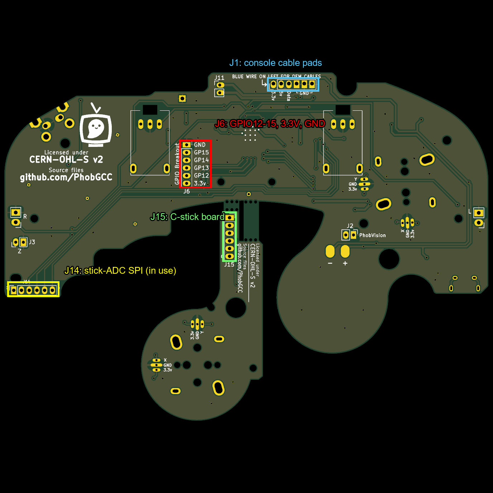
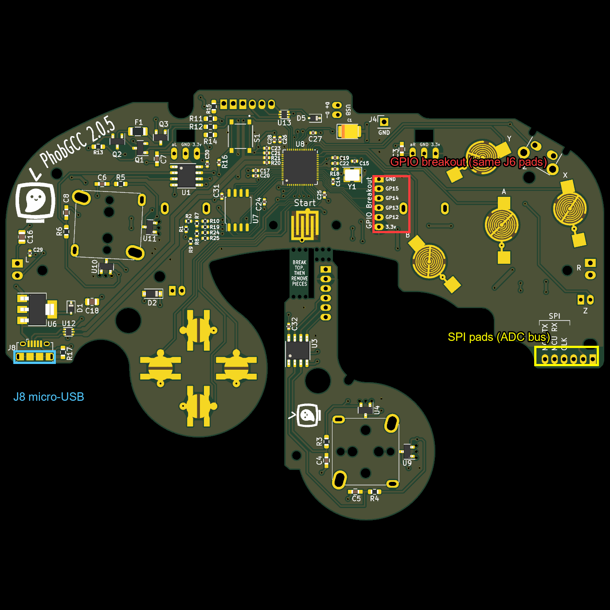

# Fact file: PhobGCC

**PhobGCC** = open-source replacement board and firmware for a GameCube controller. Org: https://github.com/PhobGCC (firmware `PhobGCC-SW`, docs `PhobGCC-doc`, hardware `PhobGCCv2-HW`). Pinned firmware here: `upstream/PhobGCC-SW` @ b4f175e (2025-11-15).

Verified 2026-10-09 from `upstream/Wireless-PhobGCC-nRF24/Wireless_Transmitter/include/Phob2_0.h` (the PhobGCC 2.0 pin map):
- RP2040 GPIO: A 17, B 16, X 18, Y 19, Z 20, L 22, R 21, Start 5; D-pad Left 8, Up 9, Down 10, Right 11; rumble 25; brake 29; joybus data 28; status LED 15; spare 12, 13, 14.
- Stick sensing uses external ADCs (analog-to-digital converters) on SPI: clock 6, MOSI 7, MISO 4; chip-selects 24 (A stick) and 23 (C stick). Analog triggers on ADC pins 26 and 27.
- Pins 0-3 form a small resistor-ladder DAC (digital-to-analog converter).

See the section below for what was read from PhobGCC-doc and the hardware repo.

## Added 2026-10-09: from PhobGCC-doc and PhobGCCv2-HW
Sources: `upstream/PhobGCC-doc` @ 23e9192 (2026-08-14), `upstream/PhobGCCv2-HW` @ ff645aa (2023-04-17; board licensed CERN-OHL-S v2, "strongly reciprocal": changes to the board must be published and `CHANGES.txt` updated, per its README).

- **What it is:** a replacement motherboard for a GameCube controller (GCC). It reads stick position with magnets and Hall-effect sensors instead of wearing potentiometers (PhobGCC-doc `README.md`).
- **The Phob 2 board has its own RP2040 microcontroller**, flash chip (W25Q128JVS) and stick ADCs (MCP3202). The ordering guide says: "Teensy or Raspberry Pi Pico: the PhobGCC 2 has no need of any external microcontroller board." (`For_Makers/Phob2_Ordering_Guide.md`). So the bridge's RP2040 is a *second*, separate one.
- **Donor controller:** a build reuses parts from a donor stock GCC: 2 stickboxes, 2 trigger potentiometers, cable, rumble bracket, Z switch, optional rumble motor and trigger paddles, plus the shell (`For_Makers/Build_Guide_2.0.md`). The shell and cable are therefore reused, and the Phob board takes the place of the original motherboard. Fit in the shell: the guide warns the Z switch must sit square "or the board may not fit in the controller shell properly" and some solder pads interfere with a rib on the front shell; a USB jack/PhobVision jack are described as tight with the OEM rumble motor.
- **Board parts** (counted in `PhobGCC_2_0_0_proto_1.kicad_sch`): RP2040, 2x AMS1117-3.3 (3.3 V regulators), nets named `+5V`, `VBUS`, `+3V3`, `GCC_3.3V`, `GCC_DATA`, 2x USB-B-micro symbols, USBLC6-2P6 (USB protection), fuses, 4x DRV5055A3 Hall sensors.
- **Spare GPIO and power pads (verified from the netlist, 2026-10-09):** KiCad 10's `kicad-cli sch export netlist` on `PhobGCC_2_0_0_proto_1.kicad_sch` shows connector **J6**, footprint `PinSocket_1x06_P2.00mm_Vertical` (a 6-pin, 2.00 mm-pitch socket), wired as: pin 1 `+3V3`, pin 2 `GPIO12`, pin 3 `GPIO13`, pin 4 `GPIO14`, pin 5 `GPIO15`, pin 6 `GND`. GPIO12-15 go to RP2040 pins 15-18. So four free RP2040 pins plus 3.3 V and ground are on one header.
- **Power path (verified from the same netlist):**
  - The GCC cable connector **J1** (`GCC_Header_Straight_1x06_Pitch2.00mm`): pin 1 `GCC_3.3V`, pin 2 `+5V`, pin 3 `GCC_DATA` (to RP2040 GPIO28), pins 4-6 `GND`.
  - `GCC_3.3V` connects only to J1 pin 1 and one pin of a USB protection chip (U13); it does **not** feed the board's 3.3 V rail.
  - The 3.3 V regulator **U6 (AMS1117-3.3)** takes its input (pin 3) from `+5V`; its output goes through Schottky diode D1 to the `+3V3` rail. `+5V` comes from J1 pin 2 (the cable) and from micro-USB VBUS (J8), joined with a P-channel MOSFET (Q2) / diode (D2) / fuse (F1) arrangement for the rumble supply. **Unverified:** exact switching behavior of Q2/D2/F1.
  - Consequence: the Phob runs from the console's 5 V line through an AMS1117 linear regulator. **Unverified (datasheet not read):** the regulator's dropout voltage and maximum current, and therefore whether a battery can feed `+5V` or whether a radio board can draw from `+3V3` on J6.
- **Version caveat:** the file is named `2_0_0_proto_1`, but the rendered board's silkscreen reads "PhobGCC 2.0.5" (see picture), matching the ordering guide's v2.0.5. The hardware repo's `CHANGES.txt` is empty. **Unverified:** that every real v2.0.5 board in circulation matches this file; check a physical board.
- **Firmware flashing:** see `For_Users/Phob2_Programming_Guide.md` (not read yet).

## Still unverified / to read
- Phob2_Programming_Guide (how firmware is loaded; matters for adding radio code).
- AMS1117-3.3 datasheet: dropout and current limit (decides battery and J6 loading).
- Space inside a stock shell for a nice!nano-size board and battery.

## Where things are on the board (pictures, 2026-10-09)
Rendered with `kicad-cli pcb render` from `PhobGCC_2_0_0_proto_1.kicad_pcb`; boxes and labels added with Pillow.

Back side (the side that faces the shell's back): 

Front side (RP2040 chip U8, buttons, stick sensors): 

- **J6 "GPIO Breakout"** is a column of 6 through-hole pads (GND, GP15, GP14, GP13, GP12, 3.3V). The same holes show on both faces, so a wire or header can go on either side. It sits just left of centre on the back and right of the RP2040 on the front.
- **Do not confuse it with other headers:** J1 = the console-cable pads (3.3V, 5V, Data, 3x GND) at the top; J14/J15 = the bus to the stick ADC chips and the C-stick board; J8 = micro-USB; J2 = PhobVision video; J3/J4 = Z-button and ground pads.

## Pin budget: how many RP2040 pins does the Phob use?
**Which RP2040?** The one **on the Phob board** (chip U8). The wireless radio board (nice!nano, nRF52840) and the bridge's separate RP2040 are different chips. This table is only about the Phob's own.

The RP2040 has 30 usable GPIO pins (GPIO0-29). Netlist assignment (verified 2026-10-09):

| GPIO | Use | GPIO | Use |
|---|---|---|---|
| 0-3 | resistor-ladder DAC | 16 | B |
| 4 | ADC SPI data in | 17 | A |
| 5 | Start | 18 | X |
| 6 | ADC SPI clock | 19 | Y |
| 7 | ADC SPI data out | 20 | Z |
| 8-11 | D-pad L/U/D/R | 21 | R |
| **12-15** | **free (J6)** | 22 | L |
| | | 23, 24 | ADC chip-selects |
| | | 25 | rumble |
| | | 26, 27 | analog L/R triggers |
| | | 28 | console data (joybus) |
| | | 29 | brake |

So **only 4 GPIOs are free** (12-15), plus 3.3V and GND on J6. J14 and the "SPI" pads are the *stick-ADC bus* (GPIO4/6/7 and the chip-selects); they are in use, though other chips could in principle share a SPI bus (**Unverified**: firmware and timing impact). The RP2040 also has dedicated debug nets (SWCLK, SWD, RUN) that are not GPIOs. For a future second project, four pins is the budget unless you share buses or use the USB port.

Practical use for this project: the nRF52 radio board attaches to J6 via up to four signals (e.g. SPI or UART) plus power; the Phob RP2040 firmware would need changes to talk on those pins (see `PHOB_CHANGES.md`, not yet written).
